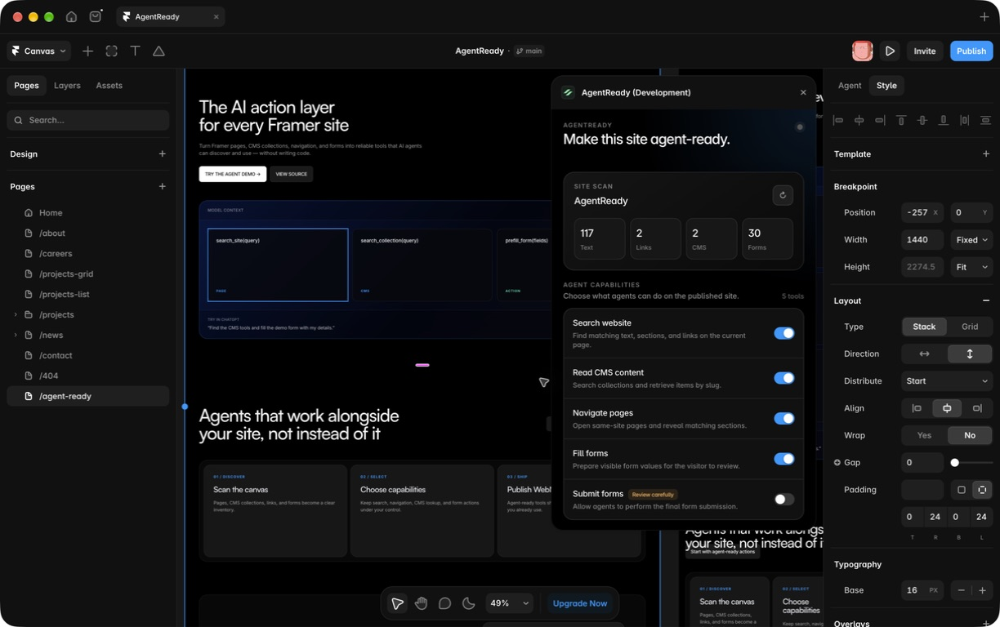

# AgentReady for Framer

[](https://github.com/masterleopold/agentready-framer/actions/workflows/ci.yml)
[](https://agentready.framer.website)
[](LICENSE)

**The no-code WebMCP builder for Framer.** AgentReady scans a Framer project, lets its owner choose what agents may do, and publishes typed tools through Framer Custom Code, Cloudflare's edge-injected WebMCP bridge, or both.

**Live demo:** [agentready.framer.website](https://agentready.framer.website)

**Live Shopify product:** [AgentReady — WebMCP Builder for Framer](https://tkigey-1f.myshopify.com/products/agentready-webmcp-builder-for-framer). The Framer playground presents Creator **$49**, Studio **$149**, and Agency **$399**; the connected Shopify development store currently charges the corresponding configured variants in JPY (¥7,500 / ¥22,500 / ¥60,000). Selecting a plan opens that exact variant through Shopify's hosted cart, while payment remains an explicit human action.



## What it does

Browser agents normally infer intent from pixels and DOM structure. WebMCP lets a site expose explicit tools through `document.modelContext.registerTool()`. AgentReady turns Framer pages, CMS collections, forms, conversations, commerce, and paid content into a capability-scoped tool surface without requiring the site owner to write WebMCP code.

| Surface | AgentReady capability | Human and security boundary |
| --- | --- | --- |
| Pages and CMS | Search visible content, query CMS snapshots, retrieve items, and navigate within the site | Same-origin navigation only; draft CMS records are excluded |
| Forms | Inspect and prepare text, numbers, addresses, checkboxes, radios, selects, multi-selects, dates, times, accessible calendars, and multi-step flows | Submission is separately enabled and sensitive forms are refused |
| Files | Detect constraints and open the secure file picker; optional Turnstile + R2 handoff | The person selects the local file; bytes never enter model arguments |
| Conversations | Read visible turns, compose a message, and optionally send and wait for the reply | Sending is a separately enabled external action |
| Generic checkout | Prepare plans, quantities, contact details, addresses, shipping, and coupons | Card/bank data, passwords, OTPs, wallet authentication, and final confirmation remain human-only |
| Shopify | Storefront MCP + UCP catalog, product and policy lookup, cart changes, and Shopify Checkout handoff | Cart secrets stay in browser storage; Shopify owns payment authentication and confirmation |
| Cloudflare Agentic Payments | Inspect offers and return MPP/x402 `402` challenges, retry guidance, receipts, and verified order identifiers | Scoped payment credentials remain with the paying agent, never Framer or WebMCP arguments |
| Cloudflare Pay Per Crawl | Advertise pricing and permitted purposes and serve licensed structured JSON with a content digest | Cloudflare performs crawler identity, enforcement, settlement, and charge evidence |
| Knowledge and trust | Cloudflare AI Search, cited answers, same-origin SHA-256 attestations, anonymous metrics, and Browser Run verification | Retrieved content is untrusted; administration and secrets stay server-side |

The complete Direct runtime contains **30 optional tools**. A site only publishes the capabilities its owner enables, so counts vary by configuration. As of **September 4, 2026**, the public Framer demo exposes **all 30 browser tools**, including seven Shopify commerce tools connected to `tkigey-1f.myshopify.com`, plus deployed Cloudflare Agentic Payments and Intelligence Workers. The public runtime is checked end to end by `npm run test:live`.

The exact inventory and boundaries are documented in [docs/capability-matrix.md](docs/capability-matrix.md).

## Delivery architecture

```text
Framer plugin
   ├─ scans the canvas and CMS
   ├─ generates a narrow runtime configuration
   └─ publishes Custom Code
            │
            ├─ Direct: browser-local WebMCP tools
            └─ Hybrid: browser-local actions + same-origin /mcp
                                                   │
                                                   └─ Cloudflare Workers
                                                      knowledge · Shopify reads
                                                      payments · paid JSON · trust
```

| Mode | Registered tools | Best fit |
| --- | ---: | --- |
| **Direct** | Up to 30 | Framer-hosted sites and the fastest zero-infrastructure setup |
| **Hybrid** (recommended) | Up to 31 AgentReady tools | A Cloudflare-proxied custom domain; UI state stays local and credentialed integrations stay at the edge |
| **Cloudflare Bridge** | Up to 11 gateway tools | Server-backed discovery and read operations without local DOM tools |

Hybrid moves ten network-backed tools to the same-origin `/mcp` gateway, preserves the remaining browser-state tools locally, and adds `agentready_edge_status`. It de-duplicates names automatically. Cloudflare's optional external Content Credentials pack adds two more image-metadata tools; those tools are managed by Cloudflare and are not included in the AgentReady counts above.

The runtime follows the current WebMCP specification source and Chrome 149+ origin-trial guidance: user-facing titles, narrow JSON Schemas, observed registration Promises, abortable registration and execution, the standardized `readOnlyHint` and `untrustedContentHint` annotations, visible UI state changes, and human review for sensitive or irreversible actions. AgentReady applies Chrome's defensive metadata budgets (30-character names, 500-character tool descriptions, and 150-character parameter descriptions) and bounds each returned result to 1,500 characters. Oversized responses become a structured, retryable truncation result that tells the agent how to narrow the call.

Chrome's origin trial supports both imperative and declarative tools. AgentReady uses imperative tools for Framer custom controls, multi-step state, chat, commerce, and explicit safety boundaries. Native forms that already declare `toolname` are left to Chrome's declarative API instead of receiving overlapping imperative behavior; AgentReady also styles `:tool-form-active` and `:tool-submit-active` and mirrors `toolactivated` / `toolcancel` into an `agentready:declarative-state` event.

## Try the live demo

Open [agentready.framer.website](https://agentready.framer.website) in ChatGPT's in-app browser or Chrome 149+ with WebMCP enabled and try prompts such as:

The direct `framer.website` URL cannot set the WebMCP response headers on the demo's current free Framer plan. For strict production conformance, proxy a custom domain through the included Cloudflare Worker (which adds `Origin-Agent-Cluster: ?1` and `Permissions-Policy: tools=(self)`) or configure equivalent Framer custom headers on a supported plan.

- “Find the available form tools and prepare the application with my address, preferences, and appointment time.”
- “Read the latest chatbot reply, compose a follow-up question, and wait for me before sending it.”
- “Inspect the checkout and prepare every non-sensitive field. Leave payment and final confirmation to me.”
- “Find the AgentReady product in Shopify, compare its three license variants, and add the Studio variant to the cart. Stop before checkout.”
- “Find the AgentReady plugin offer and explain the available purchase or payment handoff.”

The demo contains real multi-step forms, option groups, date/time inputs, file-picker handoff, a conversational UI, safe checkout, Shopify and Cloudflare examples, and the AgentReady runtime installed through Framer Custom Code.

### Verify with ChatGPT Site tools

The challenge judge path uses **Site tools**, ChatGPT's WebMCP implementation. Use the latest ChatGPT desktop app, select GPT-5.6 Sol or GPT-5.6 Terra, and enable **Settings → Browser → Permissions → Enable site tools**. Enterprise and Edu workspaces, GPT-5.6 Luna, declarative form tools, and tools registered inside iframes are not currently supported by ChatGPT's in-app browser.

1. Open `https://agentready.framer.website/?judge=20260904` in ChatGPT's in-app browser.
2. Open **Site tools → Available site tools** in the address bar and confirm that the page exposes 30 tools.
3. Ask: “Use `search_site` to find the AgentReady purchase section.”
4. Ask: “Use `inspect_forms`, then `prefill_form` with name Demo Agent and email agent@example.com. Do not submit.”
5. Ask: “Search Shopify for AgentReady, compare the three plans, add Studio to the cart, and stop before checkout.”

The expected boundary is deliberate: discovery, form preparation, and cart preparation are available to the agent; form submission, payment credentials, and final purchase confirmation remain with the person. If the browser shows stale content, reload with a new query parameter.

## Run the Framer plugin

Requirements:

- Node.js 20 or newer
- A Framer account with Plugin Developer Tools enabled

```bash
git clone https://github.com/masterleopold/agentready-framer.git
cd agentready-framer
npm install
npm run dev
```

In Framer, enable Plugin Developer Tools and choose **Open Development Plugin**. The product flow is:

```text
Scan project → Review capabilities → Choose delivery → Install tools → Publish → Test
```

Framer isolates plugin data and Custom Code by plugin identity. A localhost development build therefore cannot read a runtime previously installed by a different identity such as **API Plugin**. On the AgentReady demo project, use **Load live demo settings** to restore the public Shopify and Cloudflare endpoints without publishing. Before installing from the development plugin, remove the separate **API Plugin** Custom Code entry; otherwise Framer will publish two runtimes. Keep exactly one `agentready-webmcp` installation.

For Chrome 149+ live testing, register the published first-party origin in the WebMCP origin trial and paste the complete token into **Chrome 149+ Origin Trial**. AgentReady installs it as an `origin-trial` meta element at the start of the document head. The token is origin-bound, public activation metadata—not a secret. For local development, leave it empty and enable `chrome://flags/#enable-webmcp-testing` instead.

Build the Framer Marketplace archive with `npm run pack`. Prepared Marketplace copy and media requirements are in [docs/marketplace-listing.md](docs/marketplace-listing.md). Workspace teams may instead host the static `dist` directory on Vercel or Cloudflare Pages, with `framer.json` at the deployment root. Plugin UI hosting is separate from the optional Workers that provide edge integrations.

## Add the Cloudflare Hybrid gateway

The repository includes five deployment-ready Worker configurations: coordination/uploads, Agentic Payments, Pay Per Crawl JSON delivery, intelligence, and the WebMCP gateway. They require your own Cloudflare account resources, routes, and secrets; the repository does not deploy them automatically.

```bash
npm install --prefix cloudflare
npm run typecheck --prefix cloudflare
npm run deploy:mcp --prefix cloudflare
```

Then:

1. Replace the example origins and bindings in `cloudflare/wrangler.mcp.jsonc` and the configurations for any optional Workers you use.
2. Route the gateway to the Framer custom domain at `/mcp*`. Do not configure a cross-origin `*.workers.dev` URL as the plugin's MCP path.
3. In Cloudflare Dashboard, open **Agent Readiness → WebMCP**, enable the Site MCP Server pack, and set its URL to `/mcp`.
4. In AgentReady, select **Hybrid**, use the same `/mcp` path, install the tools, and publish the site.
5. Confirm that the published HTML contains `/.webmcp/bridge.js`, then test MCP `initialize`, `tools/list`, and a safe tool call.

Optionally enable Cloudflare's Content Credentials pack. The current Developer Preview decodes embedded C2PA metadata but reports `signatureVerified: false`; it must not be presented as cryptographic signature verification.

Detailed provisioning, secrets, routes, and production caveats are in [cloudflare/README.md](cloudflare/README.md).

## Shopify connection

**Auto** mode discovers Shopify's standard Storefront MCP tools at `/api/mcp` and UCP catalog tools at `/api/ucp/mcp`, caches their advertised schemas for five minutes, and adapts cart arguments to the store's discovered `update_cart` schema. UCP requests include the configured HTTPS agent profile.

For browser deployments, configure the optional standard MCP proxy when Shopify's `/api/mcp` preflight is blocked by CORS. The included Cloudflare Intelligence Worker exposes `/v1/shopify/mcp`, fixes the destination to the configured `.myshopify.com` store, allows only policy and cart tools, forwards no caller credentials, and serves the AgentReady UCP profile at `/.well-known/ucp-agent.json`.

If a store restricts MCP, catalog and cart operations fall back to Storefront GraphQL. An empty UCP eligibility result also falls back to the public catalog in **Auto** mode so newly published products remain discoverable while review state propagates. Merchant policy answers and complete UCP behavior explicitly report themselves unavailable rather than inventing results.

The live demo uses the AgentReady-owned profile at [`/.well-known/ucp-agent.json`](https://agentready-intelligence.hara-7b1.workers.dev/.well-known/ucp-agent.json). Shopify's native UCP catalog currently returns the public AgentReady product, its Creator / Studio / Agency variants, localized JPY prices, availability, and hosted checkout URLs. `npm run test:live` verifies this real catalog result in addition to the 30 registered WebMCP tools.

References: [Shopify Storefront MCP](https://shopify.dev/docs/apps/build/storefront-mcp/servers/storefront), [UCP catalog MCP binding](https://ucp.dev/latest/specification/shopping/catalog/mcp/), and [Shopify API terms](https://www.shopify.com/legal/api-terms).

## Safety model

- Form preparation and submission are separate capabilities; submission is disabled by default.
- `submit_form` refuses checkout, authentication, and sensitive forms even when enabled.
- Payment credentials, card data, bank details, passwords, PINs, OTPs, passkeys, recovery codes, wallet keys, and stored secret values are blocked.
- Shopify cart identifiers remain in browser session storage and are summarized without their secret key.
- Cloudflare payment keys stay in the paying Agent or Worker, never Framer Custom Code.
- The MCP gateway rejects cross-site browser requests, JSON-RPC batches, non-JSON or oversized bodies, unknown tools, invalid Shopify domains, and unapproved origins.
- Analytics never records prompts, chat text, form values, tool arguments, payment data, or response bodies.
- Final purchase, hosted checkout confirmation, wallet authentication, CAPTCHA, biometrics, signatures, and local file selection stay with the person.
- Sensitive confirmation controls are marked as human-only and block untrusted synthetic clicks/submissions. Trusted browser-level automation is still an open WebMCP platform issue, so this is an additional defense rather than a complete guarantee.

## Project structure

| Path | Purpose |
| --- | --- |
| `src/` | Framer plugin UI, scanner, configuration, runtime generator, and styles |
| `framer/` | Code components used by the interactive demo page |
| `cloudflare/` | Five optional Worker configurations and edge implementation |
| `scripts/` | Isolated runtime, gateway, live-site, and demo validation |
| `docs/` | Capability matrix, WebMCP design, coverage audit, challenge checklist, and submission material |

## Validate the repository

```bash
npm run typecheck
npm run lint
npm test
npm run check:demo
npm run build
npm run pack
npm run typecheck --prefix cloudflare
```

`npm test` executes all 30 Direct runtime tools in a simulated browser and validates the same-origin Cloudflare MCP gateway. Verify the deployed Framer page separately with:

```bash
AGENTREADY_DEMO_URL=https://agentready.framer.website \
AGENTREADY_STRICT_INSTALLATION=1 \
npm run test:live
```

The live Framer project has one plugin-managed AgentReady Custom Code installation. Strict validation fails if a legacy or parallel plugin identity introduces a duplicate runtime.

Then inspect the real browser surface in Chrome 149+:

1. Confirm the Origin Trial entry is valid in **DevTools → Application → Frames → Top** (or use the local WebMCP testing flag).
2. Inspect registered tools and invocation history in Chrome's WebMCP debugging UI or the Model Context Tool Inspector extension.
3. Verify `window.__agentReadyRegistration` resolves with `ready: true` and no failed registrations.
4. Exercise one read-only tool, one visible form-preparation tool, cancellation of a waiting tool, and one human-only refusal.

Official references: [WebMCP overview](https://developer.chrome.com/docs/ai/webmcp), [origin trial](https://developer.chrome.com/blog/ai-webmcp-origin-trial), [secure tools](https://developer.chrome.com/docs/ai/webmcp/secure-tools), and [origin-trial setup](https://developer.chrome.com/docs/web-platform/origin-trials).

CI runs type checking, linting, the runtime and gateway tests, the demo component check, production build, plugin packaging, Cloudflare type checking, and dry-run builds for all five Workers.

## Current limitations

- CMS content is snapshotted at publish time; re-run the plugin after CMS changes.
- Form discovery is heuristic, and runtime fields need a `name`, `id`, or `aria-label`.
- The scanner currently covers the active canvas and project CMS collections.
- Cross-origin iframes, hosted card fields, and closed Shadow DOM are intentionally opaque.
- WebMCP remains experimental and host support varies.
- Origin-trial tokens expire and must match the exact published origin. Verify status in Chrome DevTools; feature detection remains authoritative.
- Automatic MPP/x402 fulfillment requires a compatible payment-aware host. Other hosts can inspect the challenge and continue through a human handoff.
- Self-hosted deployments must configure their own Shopify product/variant IDs or HTTPS checkout URL. The public demo has a live product, but no merchant credentials or simulated completed payments ship in this repository.
- Pay Per Crawl requires an enrolled Cloudflare zone. The Worker adds structured JSON; Cloudflare performs billing enforcement.

## Support

Setup, operational boundaries, and common validation commands are documented in this README and the linked guides below. Report reproducible problems through [GitHub Issues](https://github.com/masterleopold/agentready-framer/issues). Include the Framer project state, browser/version, delivery mode, and the exact error message, but never include API keys, payment credentials, Storefront cart secrets, passwords, or form data.

## Documentation

- [Capability and safety matrix](docs/capability-matrix.md)
- [WebMCP design notes](docs/webmcp-design.md)
- [WebMCP specification, explainer, and open-issues audit](docs/webmcp-spec-audit.md)
- [Request coverage and launch status](docs/request-coverage.md)
- [Challenge checklist](docs/challenge-checklist.md)
- [Submission copy, demo prompts, and video outline](docs/submission.md)
- [Framer Marketplace listing and publication preflight](docs/marketplace-listing.md)
- [Cloudflare deployment guide](cloudflare/README.md)

## License

[MIT](LICENSE)
